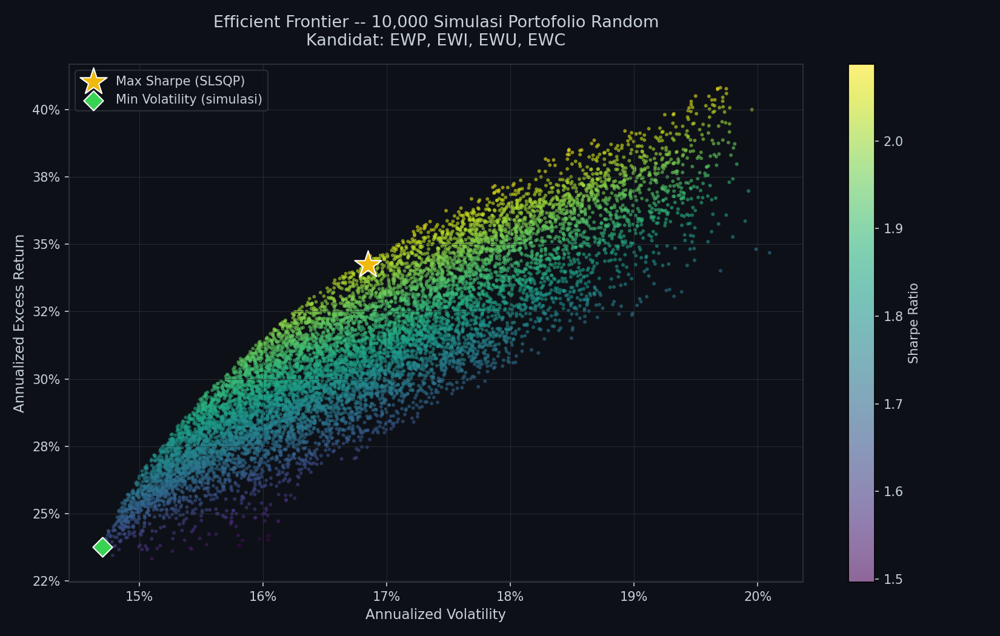
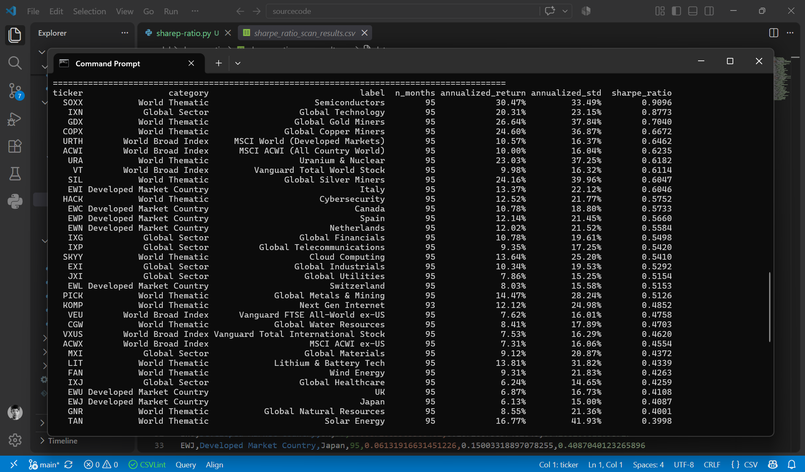

# Sharpe Portfolio Optimizer

Sharpe ratio screener & max-Sharpe portfolio optimizer for any ticker on the market — powered by `yfinance`.

## Overview

This toolkit lets you:
1. Scan Sharpe ratios across any list of tickers (stocks, ETFs, indices — anything available on yfinance).
2. Optimize a max-Sharpe portfolio from the top-ranked candidates using mean-variance optimization.
3. Visualize the efficient frontier via Monte Carlo simulation of random portfolio weights.

Risk-free rate used throughout is the US 10-Year Treasury yield (`US_10Y`), loaded from a local CSV.

## File Structure

| File | Description |
|---|---|
| `sharep-ratio.py` | Computes the Sharpe ratio for a single ticker (default: SGOV) against the dynamic US_10Y risk-free rate. |
| `sharep-ratio-scan.py` | Scans Sharpe ratios across many tickers at once (world indices, sector ETFs, country ETFs, thematic ETFs) from `tickers.csv` / `tickers_generated.csv`. Results are saved to `sharpe_ratio_scan_results.csv`. |
| `porto.py` | Pulls the top-N tickers from `sharpe_ratio_scan_results.csv`, then optimizes portfolio weights for maximum Sharpe ratio (long-only, mean-variance) using `scipy.optimize`. Includes a 10,000-run Monte Carlo simulation to plot the efficient frontier. |
| `data_us10y.csv` | Historical US 10-Year Treasury yield data (source: FRED), used as the risk-free rate across all scripts. |
| `tickers.csv` | Manually curated ticker list (columns: `ticker, category, label`). |
| `tickers_generated.csv` | Auto-generated ticker list (columns: `ticker, type, sector, name`). |
| `sharpe_ratio_scan_results.csv` | Output of the Sharpe ratio scan, sorted from highest to lowest. |

## Requirements

\`\`\`bash
pip install yfinance numpy pandas scipy matplotlib
\`\`\`

## Usage

1. **Scan Sharpe ratios across all candidates:**
   \`\`\`bash
   python sharep-ratio-scan.py
   \`\`\`
   Generates `sharpe_ratio_scan_results.csv`.

2. **Optimize a max-Sharpe portfolio from the top-N scan results:**
   \`\`\`bash
   python porto.py
   \`\`\`
   Automatically pulls the top `TOP_N` tickers (default 4) from `sharpe_ratio_scan_results.csv`, computes optimal weights, and pops up an efficient frontier chart.

3. **Check the Sharpe ratio of a single ticker:**
   \`\`\`bash
   python sharep-ratio.py
   \`\`\`

## Output

### Efficient Frontier (`porto.py`)

The gold star marks the max-Sharpe portfolio found via SLSQP optimization. The green diamond marks the lowest-volatility portfolio from 10,000 random simulations. Point color represents each portfolio's Sharpe ratio.

### Sample Terminal Output

## Notes

- The risk-free rate (US_10Y) is read from `data_us10y.csv` rather than a live database — update this file periodically if you want the latest data.
- `MAX_WEIGHT_PER_ASSET` in `porto.py` caps the maximum weight per asset (default 50%) to avoid an all-in allocation to a single asset.
- All backtests/optimizations here are in-sample — no out-of-sample or forward-test validation is included in this toolkit.
